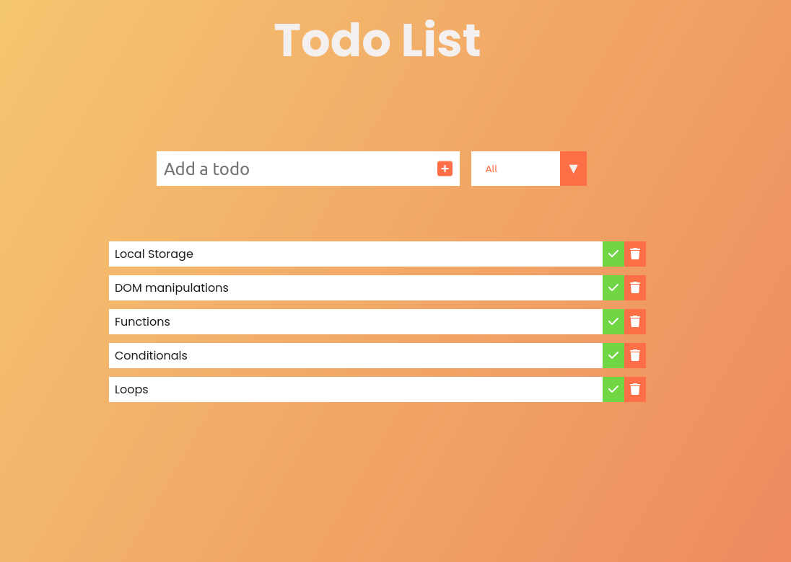

#Simple Todo List App with HTML/CSS and JS

Very basic app with a simple animation where the user can add and remove items from the todo list as well as filter tasks that are whether completed or incompleted.

## JavaScript used:

-Arrays

- Local Storage
- DOM manipulations
- functions
- conditionals
- loops

:smile:

## Screenshots

